# Full Features Guide

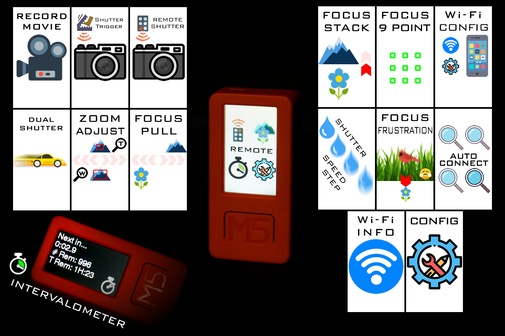

## Preface

This project is not a product, it is my experiment. Some of the features I've implemented are purely for fun and are gimmicks. Some of them may not work all of the time, and have camera compatibility issues.

## Remote Shutter

Press the big button to take a photo. This functions exactly like all other camera remotes.

If the camera is not connected by Wi-Fi, and the infrared emitter feature is enabled, then pressing the big button will send out the remote shutter command via the infrared emitter.

If the camera is not connected by Wi-Fi, and the infrared emitter feature is disabled, and the GPIO feature is enabled, then pressing the big button will send out the remote shutter command via the shutter release cable connected to the GPIO.

## Timed Remote Shutter

Uses a countdown before sending the remote shutter command.

Rotate the remote to change the time delay amount.

## Movie

Press to start or stop movie recording.

This feature also supports infrared emitter mode if Wi-Fi connection is not established.

When Wi-Fi is available, it attempts to display the recording status with a red dot.

## Sound Shutter

When armed, the remote will send the shutter command when the microphone detects a loud sound.

The triggering sound level can be adjusted. The sound level and triggering threshold are displayed as a bar at the top of the screen.

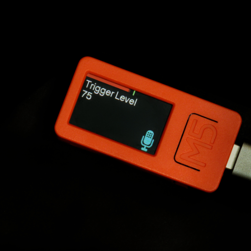

The side-button navigates through items. The big-button will edit the current item. The tilt angle of the remote determines if the big-button will add or subtract from the value. When the item says "ARMED", it means the trigger is armed, the trigger is not armed when you are editing the settings.

Optionally, a time delay can be set. When the trigger sound is detected, the remote will wait for a while before sending the shutter command.

NOTE: this was super fun to implement, and annoying because the button clicks usually trigger the mic, and I had to put in code to prevent that

NOTE: it is a very basic peak detector, it cannot detect words like "cheese", which is what inspired this feature

## Focus Pull

Adjusts the camera's manual focus. The adjustment speed is determined by the tilt angle of the remote. Press the big-button to actually perform the adjustment.

## Zoom Adjust

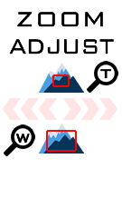

Adjusts the camera's zoom. The tilt angle determines the direction of the zoom adjustment. Press the big-button to actually perform the adjustment.

NOTE: this only works with lenses with motorized zoom

NOTE: the speed of the zoom cannot actually be controlled, even though there are three arrows indicating

## Intervalometer

The intervalometer mode has configurable options for

 * shutter bulb time
   * set to zero to use the camera's own shutter speed instead of bulb mode
 * interval between photos
 * start delay before first photo
 * number of photos

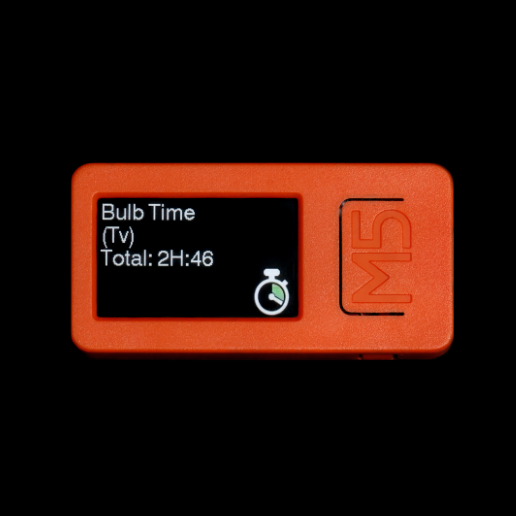

NOTE: in astrophotography mode, instead of interval between photos, the user sets a pause between each photo.

The side-button navigates through items. The big-button will edit the current item. The tilt angle of the remote determines if the big-button will add or subtract from the value. There is a start screen with all of the settings displayed to review, pressing the big-button on this screen will begin the intervalometer.

NOTE: if Wi-Fi is not connected, the method of sending the shutter command will use the infrared emitter or GPIO (shutter release cable), depending on which one is enabled in the configuration

## Focus Stacking

When activated, the camera will start to continuously take photos, and perform a focus adjustment in between each photo. The adjustment is from near to far, so it is recommended to start the camera's focusing point at the minimum focusing point of the lens.

https://user-images.githubusercontent.com/1427911/187117478-654adc80-a0a3-48cf-8b0b-643bfd7b2884.mp4

There are two focus step sizes available, indicated by the red arrow.

The camera must be placed in manual focus mode.

To learn more about focus stacking: [click here for the Wikipedia article](https://en.wikipedia.org/wiki/Focus_stacking)

NOTE: the camera's API offers 3 step sizes, but the biggest step size is too large to be useful

## 9-point Focus

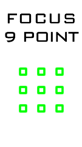

When activated, the camera will start to continuously take photos, and change the focus spot to one of 9 points between each photo.

https://user-images.githubusercontent.com/1427911/187118098-8fa0dbad-dda0-40ed-ad42-8bafc61e2450.mp4

The camera must be placed in movable spot autofocus mode.

## Shutter Speed Step

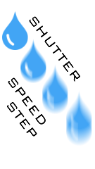

This is an experimental feature that does not work very well.

When activated, the camera will start to continuously take photos, and change the shutter speed to a slower speed between each photo.

https://user-images.githubusercontent.com/1427911/187117818-dda28b7c-d5e2-45bd-96e9-6ff3c6a178e0.mp4

The camera must be placed in Shutter Priority mode or Manual Exposure mode.

This is an experimental feature, meant to allow for experimentation with long exposures without touching the camera.

NOTE: this mode does not work very well, the camera does not seem to respond to the speed setting command 100% of the time

## Dual Shutter

This is an experimental feature that does not work very well.

The goal is to take two photos in quick succession, but each photo has a different shutter speed.

The shutter speed (and ISO setting) for the first photo will be the setting on the camera. The second photo's settings will be the settings registered into the remote.

To register settings for the second photo, be on the "register settings" screen. Use the camera's controls to set the settings you want, and then press the big-button. The settings will then be displayed on the screen.

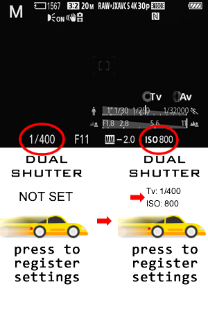

Once the settings are registered, set your camera to the settings for the first photo. Then navigate to the "press to shoot" screen. Now either half-press the shutter button on the camera, or press the big-button on the remote. The sequence of photos will be taken.

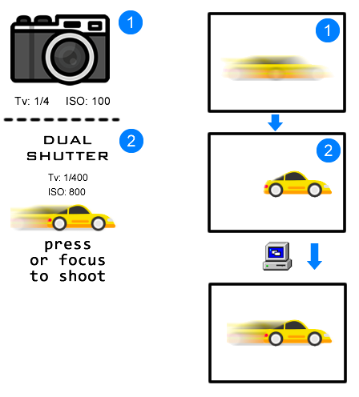

Use photo editing software to merge the two photos.

NOTE: this mode does not work very well, the camera does not seem to respond to the speed setting command 100% of the time

## Focus Frustration

When the remote is in this mode, and the user repeatedly activates and deactivates autofocus (repeatedly tapping half-pressing the shutter button), the remote will issue a manual focus command to place the focus plane at the minimum focus distance.

This is an experimental feature, meant more as a joke, for those situations when the camera's AF locks onto the background and refuses to focus onto the subject you actually want it to focus on.

NOTE: the reporting rate of the focus status from the camera is rather slow, so the rapid tapping detection doesn't work very reliably

## Auto Connect

Scans for Wi-Fi access points. It does two different searches:

 * first searches for any SSIDs that the remote already has in the Wi-Fi profile database
 * if none are found, it then looks for any SSIDs that appears to be a Sony camera

When a SSID is found, a connection will be attempted. If a password is required, the user will be prompted to enter the password.

## Configuration

Some options like the power-save timeout can be edited through the configuration screen.

The side-button navigates through items. The big-button will edit the current item. The tilt angle of the remote determines if the big-button will add or subtract from the value.

There is an explicit save-and-exit item, press the big button on it to save the new settings. If the power button is pressed, the configuration screen will exit without saving.

## Wi-Fi Configuration

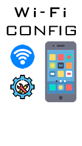

Entering the Wi-Fi configuration menu item will launch the HTTP server, and the remote will begin operating as a soft-AP (access point) with the default SSID and default password (SSID: "fairywifi", password: "1234567890").

The submenu items contain information and QR codes for a smartphone to establish a connection to the remote.

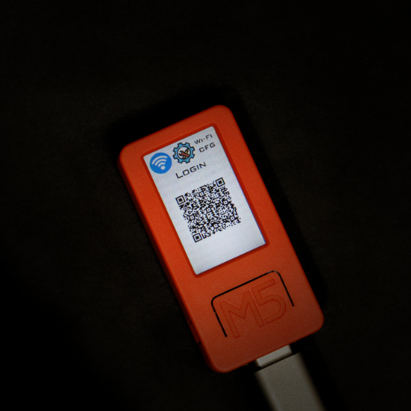

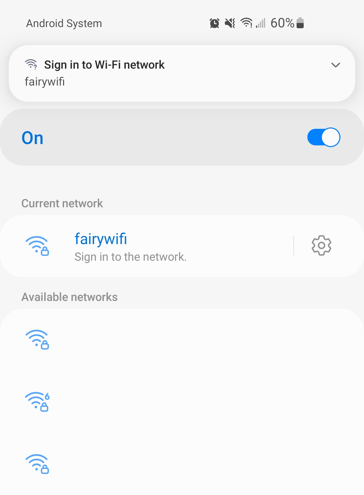

With a smartphone browser, the entire list of Wi-Fi profiles (ie. cameras registered with the remote) can be edited, and also new entries can be added.

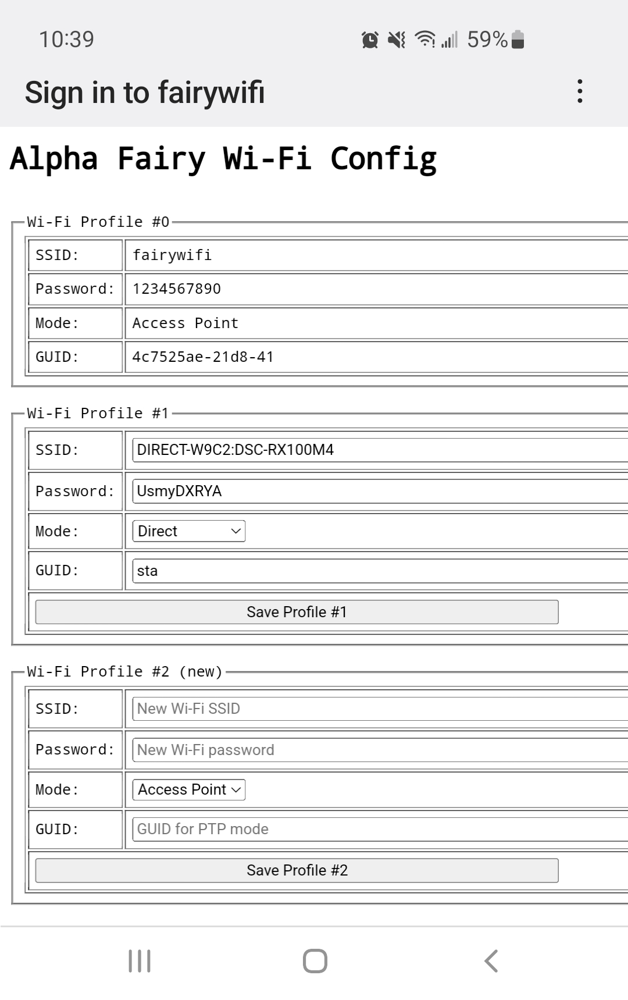

NOTE: this uses a captive portal, but another QR code is provided for a normal web browser too

One of the submenu items is the profile switcher. Rotate the remote to select another profile number. Press the big-button to save the selection, that profile will be used on the next boot. Press and hold the big-button to save and reboot the remote immediately.

One of these submenu items is a factory reset option.

## Wi-Fi Info

This will simply display the current Wi-Fi settings, useful to look at while the user is configuring the camera.

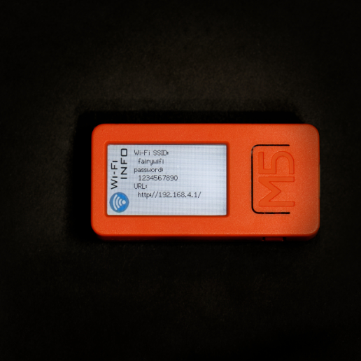

When a camera is connected, this screen will also show the camera's name.
