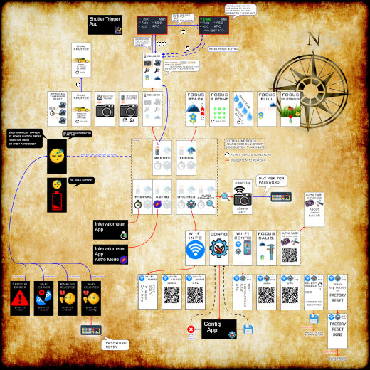
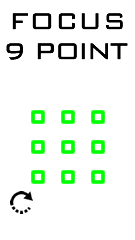
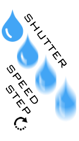
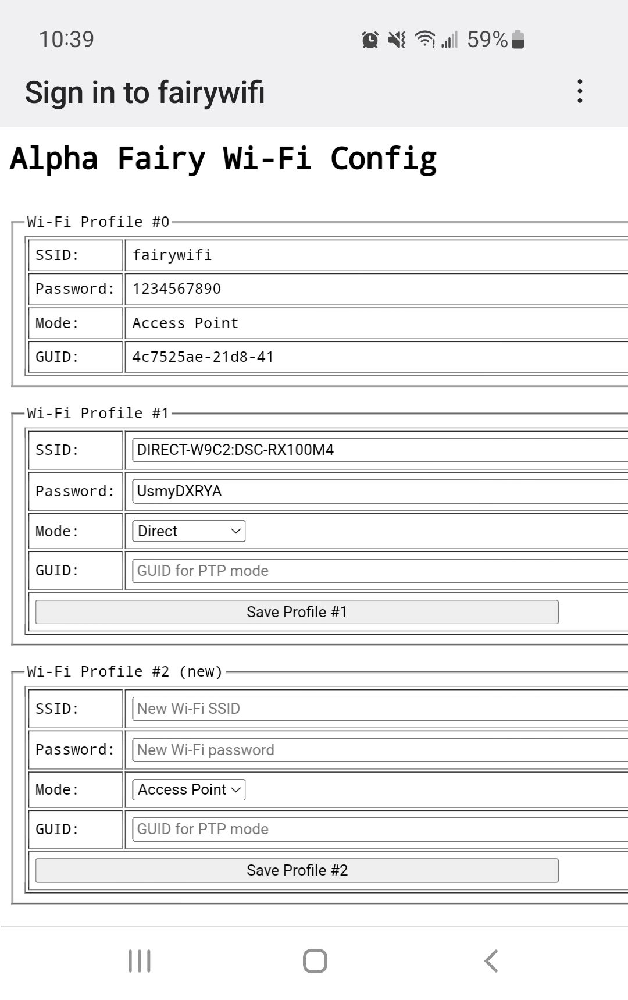

# Full Features Guide

## Preface

This project is not a product, it is my experiment. Some of the features I've implemented are purely for fun and are gimmicks. Some of them may not work all of the time, and have camera compatibility issues.

## Map of All Menu Items

[Click to zoom in](https://raw.githubusercontent.com/frank26080115/alpha-fairy/main/doc/img/menu_map.webp)

## Quick Remote

Press the side button to lock or unlock the motion selection, rotate the remote to change the selection. Pressing the big button will activate the function that is selected.

If the camera is not connected by Wi-Fi, and the infrared emitter feature is enabled, then pressing the big button will send out the remote shutter command via the infrared emitter.

If the camera is not connected by Wi-Fi, and the infrared emitter feature is disabled, and the GPIO feature is enabled, then pressing the big button will send out the remote shutter command via the shutter release cable connected to the GPIO.

The focus function and zoom function are only functional on lenses that have those functions.

## Timed Remote Shutter

Uses a countdown before sending the remote shutter command.

Rotate the remote to change the time delay amount.

## Shutter Trigger

The trigger source is configurable between: ALL (any), microphone, external input, IMU

The trigger action is configurable between: photo, video, intervalometer

The option "Arm Delay" is a delay after pressing the Arm button before triggering is allowed. This gives you a chance to run away from the boobytrap you just set.

The option "Start Delay" is the delay between triggering and taking the action.

The option "Re-arm" means automatically arm again after taking the action. This is used for unsupervised security camera style tasks. This can be disabled.

There will be a display of the relevant sensor value on the top of the screen. The triggering threshold is indicated with a tick, and can be adjusted.

The microphone uses a very simple peak detector algorithm, it cannot recognize words.

The external-input mode uses a voltage threshold (represented in 0-100%, 100% maps to 3.3V), it uses the ADC of the ESP32, the pin number is configurable through the main configuration menu. The signal can be inverted. Use this mode with PIR sensors, laser beam-break sensors, weight sensors, etc.

The IMU motion mode uses acceleration (in G units, between 0 and 4 G) and gyro spin (in DPS, between 0 and 500 DPS).

## Talley Light

The entire screen will turn bright red when the camera is recording a movie.

When the camera stops recording, the red screen will disappear and the remote will go back to normal state. Pressing any button will also clear the screen and make the remote go back to normal.

This feature can be disabled through the configuration menu.

## Virtual Top Panel

This is a simple camera settings display. (inspired by cameras that actually have this as a real feature)

It is activated by using the Quick-Remote feature, but tilting forward to the extreme. Pressing the side-button will lock it into this mode once this mode is displayed. Pressing the big-button will cycle through 4 display styles (landscape vs portrait, black vs white).

Pressing-and-holding the big button, then pressing the side button while the big button is still held, will activate **EDIT-MODE**. This mode is where the user can change the shutter speed, aperture, ISO, or exposure compensation.

In edit-mode, pressing the side button will select an item to edit, tilting the remote left or right will determine the direction of the edit, and pressing the big button will perform the edit.

## Focus Pull

Adjusts the camera's manual focus. The adjustment speed is determined by the tilt angle of the remote. Press the big-button to actually perform the adjustment.

## Focus Knob

A focus knob can be attached to the remote. It will adjust focus **linearly** on focus-by-wire lenses, one click of the knob equals a fixed number of focus adjustment steps.

The focus knob function does not need to be activated through any menus. As long as a focus knob is connected and the camera is in manual focus mode, the focus knob will work.

In the configuration menu, there are two settings that can be adjusted:

 * MF knob steps: the number of steps of MF movement to perform for every click of the knob
 * MF knob large steps: the number of queued steps before the step size changes to the larger step size

These two parameters needs to be calibrated for true linear operation, and the parameters will be different depending on which lens is attached to the camera.

There is also a utility to automatically calibrate the large steps.

## Intervalometer

The intervalometer mode has configurable options for

 * shutter bulb time
   * set to zero to use the camera's own shutter speed instead of bulb mode
 * interval between photos
 * start delay before first photo
 * number of photos

NOTE: in astrophotography mode, instead of interval between photos, the user sets a pause between each photo.

The side-button navigates through items. The big-button will edit the current item. The tilt angle of the remote determines if the big-button will add or subtract from the value. There is a start screen with all of the settings displayed to review, pressing the big-button on this screen will begin the intervalometer.

NOTE: if Wi-Fi is not connected, the method of sending the shutter command will use the infrared emitter or GPIO (shutter release cable), depending on which one is enabled in the configuration

## Focus Stacking

When activated, the camera will start to continuously take photos, and perform a focus adjustment in between each photo. The adjustment is from near to far, so it is recommended to start the camera's focusing point at the minimum focusing point of the lens.

https://user-images.githubusercontent.com/1427911/187117478-654adc80-a0a3-48cf-8b0b-643bfd7b2884.mp4

There are two focus step sizes available, indicated by the red arrow.

The camera must be placed in manual focus mode.

To learn more about focus stacking: [click here for the Wikipedia article](https://en.wikipedia.org/wiki/Focus_stacking)

NOTE: the camera's API offers 3 step sizes, but the biggest step size is too large to be useful

## 9-point Focus

When activated, the camera will start to continuously take photos, and change the focus spot to one of 9 points between each photo.

https://user-images.githubusercontent.com/1427911/187118098-8fa0dbad-dda0-40ed-ad42-8bafc61e2450.mp4

The camera must be placed in movable spot autofocus mode.

## Shutter Speed Step

This is an experimental feature that does not work very well.

When activated, the camera will start to continuously take photos, and change the shutter speed to a slower speed between each photo.

https://user-images.githubusercontent.com/1427911/187117818-dda28b7c-d5e2-45bd-96e9-6ff3c6a178e0.mp4

The camera must be placed in Shutter Priority mode or Manual Exposure mode.

This is an experimental feature, meant to allow for experimentation with long exposures without touching the camera.

NOTE: this mode does not work very well, the camera does not seem to respond to the speed setting command 100% of the time

## Dual Shutter

This is an experimental feature that does not work very well.

The goal is to take two photos in quick succession, but each photo has a different shutter speed.

The shutter speed (and ISO setting) for the first photo will be the setting on the camera. The second photo's settings will be the settings registered into the remote.

To register settings for the second photo, be on the "register settings" screen. Use the camera's controls to set the settings you want, and then press the big-button. The settings will then be displayed on the screen.

Once the settings are registered, set your camera to the settings for the first photo. Then navigate to the "press to shoot" screen. Now either half-press the shutter button on the camera, or press the big-button on the remote. The sequence of photos will be taken.

Use photo editing software to merge the two photos.

NOTE: this mode does not work very well, the camera does not seem to respond to the speed setting command 100% of the time

## Focus Frustration

When the remote is in this mode, and the user repeatedly activates and deactivates autofocus (repeatedly tapping half-pressing the shutter button), the remote will issue a manual focus command to place the focus plane at the minimum focus distance.

This is an experimental feature, meant more as a joke, for those situations when the camera's AF locks onto the background and refuses to focus onto the subject you actually want it to focus on.

NOTE: the reporting rate of the focus status from the camera is rather slow, so the rapid tapping detection doesn't work very reliably

## Auto Connect

Scans for Wi-Fi access points. It does two different searches:

 * first searches for any SSIDs that the remote already has in the Wi-Fi profile database
 * if none are found, it then looks for any SSIDs that appears to be a Sony camera

When a SSID is found, a connection will be attempted. If a password is required, the user will be prompted to enter the password.

## Configuration

Some options like the power-save timeout can be edited through the configuration screen.

The side-button navigates through items. The big-button will edit the current item. The tilt angle of the remote determines if the big-button will add or subtract from the value.

There is an explicit save-and-exit item, press the big button on it to save the new settings. If the power button is pressed, the configuration screen will exit without saving.

## Wi-Fi Configuration

Entering the Wi-Fi configuration menu item will launch the HTTP server, and the remote will begin operating as a soft-AP (access point) with the default SSID and default password (SSID: "fairywifi", password: "1234567890").

The submenu items contain information and QR codes for a smartphone to establish a connection to the remote.

**NOTE:** the screen is super tiny and your QR scanner might not actually work, sorry! Just type in the credentials manually if this is the case.

With a smartphone browser, the entire list of Wi-Fi profiles (ie. cameras registered with the remote) can be edited, and also new entries can be added.

NOTE: this uses a captive portal, but another QR code is provided for a normal web browser too

One of the submenu items is the profile switcher. Rotate the remote to select another profile number. Press the big-button to save the selection, that profile will be used on the next boot. Press and hold the big-button to save and reboot the remote immediately.

One of these submenu items is a factory reset option.

## Wi-Fi Info

This will simply display the current Wi-Fi settings, useful to look at while the user is configuring the camera.

When a camera is connected, this screen will also show the camera's name.
