This document covers:

 * Installation and setup of Arduino for ESP32
 * Building the source code and flashing onto a M5StickC-Plus unit
 * Connecting the Alpha-Fairy to a Sony Camera
 * Basic usage of the Alpha-Fairy

# Disclaimer

There are inherent dangers in the use of any software/firmware available for download on the Internet, and we caution you to make sure that you completely understand the potential risks before downloading any of the software/firmware.

The software, firmware, instructions, and code samples available on this website are provided "as is" without warranty of any kind, either express or implied. Use at your own risk.

The use of the software, firmware, instructions, and scripts on this site is done at your own discretion and risk and with agreement that you will be solely responsible for any damage to your electronic devices or loss of data that results from such activities.

You are solely responsible for adequate protection and backup of the data and equipment used in connection with any of the software or firmware, and we will not be liable for any damages that you may suffer in connection with using, modifying or distributing any of this software or firmware. No advice or information, whether oral or written, obtained by you from us or from this website shall create any warranty for the software or firmware.

We make makes no warranty that

* the software or firmware will meet your requirements
* the software or firmware will be uninterrupted, timely, secure or error-free
* the results that may be obtained from the use of the software or firmware will be effective, accurate or reliable
* the quality of the software or firmware will meet your expectations
* any errors in the software or firmware obtained from us will be corrected.

The software, firmware, code sample and their documentation made available on this website:

* could include technical or other mistakes, inaccuracies or typographical errors. We may make changes to the software or firmware or documentation made available on its web site at any time without prior-notice.
* may be out of date, and we make no commitment to update such materials.

We assume no responsibility for errors or omissions in the software or documentation available from its web site.

In no event shall we be liable to you or any third parties for any special, punitive, incidental, indirect or consequential damages of any kind, or any damages whatsoever, including, without limitation, those resulting from loss of use, data or profits, and on any theory of liability, arising out of or in connection with the use of this software or firmware.

# Quick Way: Build the image using platformio

First install [vscode](https://code.visualstudio.com/download). Then install the extension [PlatformIO](https://platformio.org/platformio-ide). After installation restart the vscode editor and open the source code directory. On the left-hand side, select the PlatformIO icon. Connect the m5stick now. Click "Project Tasks -> m5stick-c -> General -> Upload". The toolbox will automatically download the toolchain and build the project the first time it is run. After that, in "Project Tasks -> m5stick-c -> Platform" choose "Build Filesystem Image" and then "Upload Filesystem Image".

# Normal Way: Installation Setup on PC

This is an open source firmware project, it is free for anybody to download and install onto the M5StickC-Plus. I do not sell any pre-installed units, so for you to build one of these Alpha-Fairy remotes, you must follow these installation instructions.

Install [Arduino IDE](https://www.arduino.cc/en/software), please obtain **version 1.8.19**, later versions (such as v 2.x) will not work. Scroll down on the page until the `Legacy IDE (1.8.X)` section.

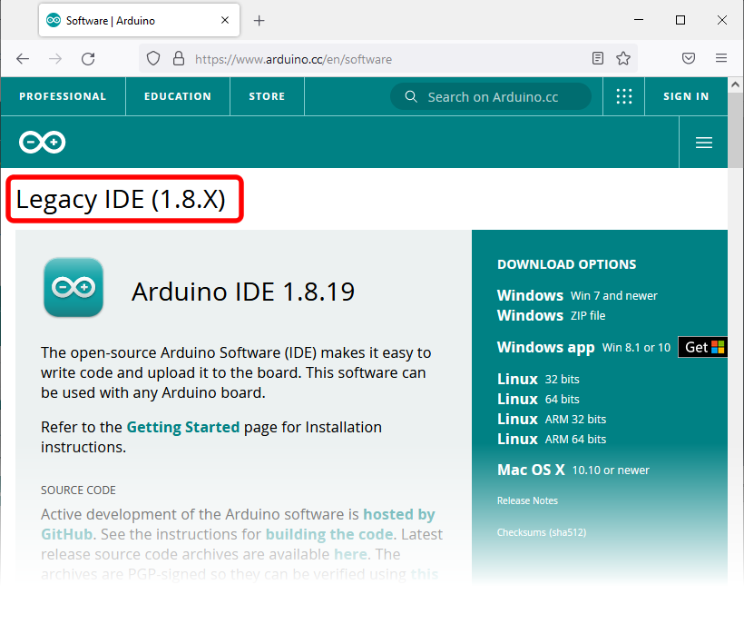

Download a copy of this particular GitHub repo.

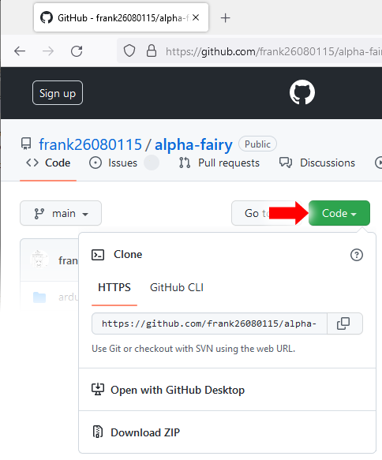

Find the directory called "arduino_workspace". From inside Arduino IDE, use the menu bar, click File->Preferences, put the path to "arduino_workspace" into "Sketchbook Location".

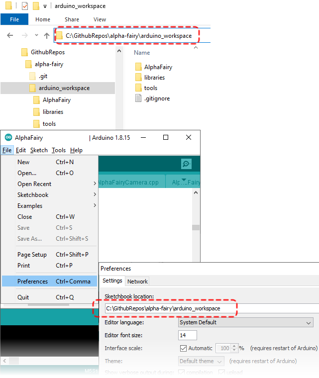

Install the ESP32 toolchain. From inside Arduino IDE, use the menu bar, click File->Preferences. The "Additional Boards Manager URLS" text box needs to be filled with "https://raw.githubusercontent.com/espressif/arduino-esp32/gh-pages/package_esp32_index.json", then click "OK".

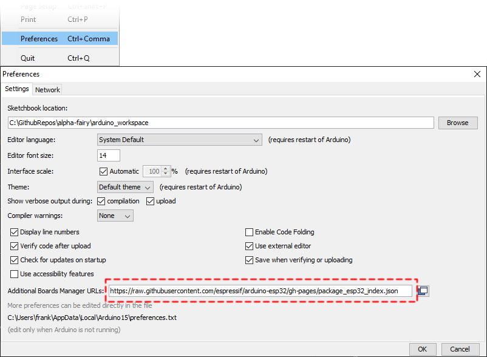

Then use the board manager to install the ESP32 toolchain. From inside Arduino IDE, use the menu bar, click Tools->Boards->Board Manager. Inside the board manager, search for "ESP32" and install the toolchain. (version 2.0.5 is fine)

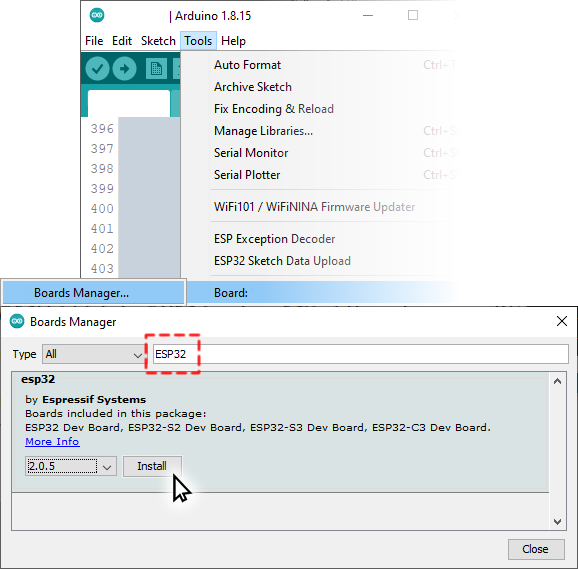

Connect the M5StickC-Plus to the computer, follow instructions to install the FTDI driver (if required): https://docs.m5stack.com/en/quick_start/m5stickc_plus/arduino (this may also contain instructions for steps I've already listed)

Close the Arduino IDE and open it again.

**NOTE:** if you are updating the firmware (thank you for keeping up to date with my project and being patient), then you will be repeating the steps below.

Open Arduino IDE, from the menu bar, select the correct board: Tools->Boards->ESP32 Boards->M5StickC

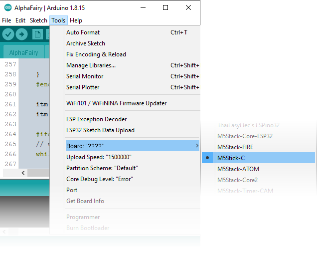

Select the correct serial port: Tools->Port->(select the option that matches the M5StickC)

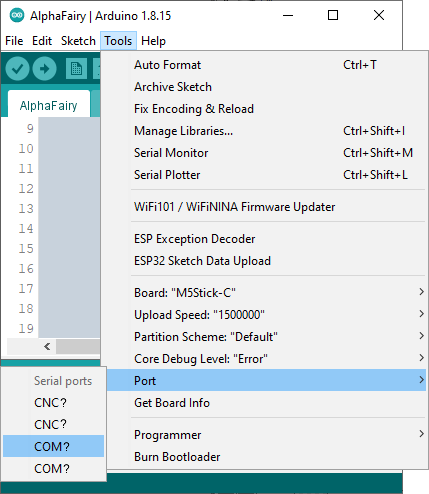

Using Arduino IDE, open the file at "arduino_workspace/AlphaFairy/AlphaFairy.ino", this should be available in the sketchbook directly.

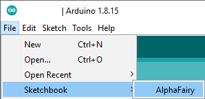

Upload the image files: Tools->"ESP32 Sketch Data Upload"

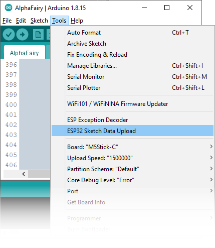

(if the "ESP32 Sketch Data Upload" is missing, follow the instructions at https://github.com/me-no-dev/arduino-esp32fs-plugin to install the plugin, which also requires you to restart the Arduino IDE)

**IMPORTANT:** every time you press "ESP32 Sketch Data Upload", the Wi-Fi profiles you have saved **will be erased**. The web interface can be used to view all existing Wi-Fi profiles so you can back them up.

Disable core debug level: Tools->"Core Debug Level:", select "None"

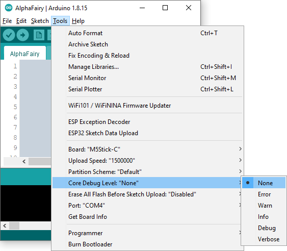

Click "Upload" on the tool-bar

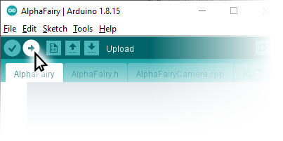

# Connecting Your Camera

Make sure your camera's Wi-Fi is configured to use the 2.4 GHz band.

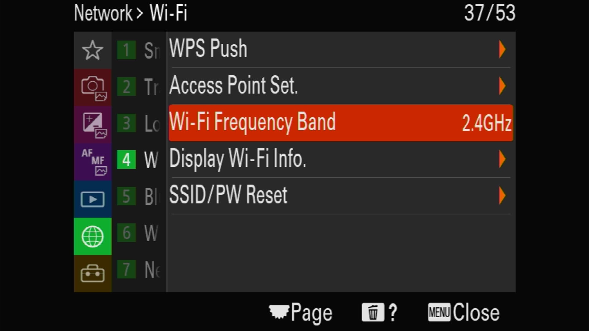

From the camera menu, the option "Still Image Save Destination" should be set to "Camera Only". There are actually two places where this is set, one for PC remote, one for smartphone remote. Please set "Camera Only" to both modes.

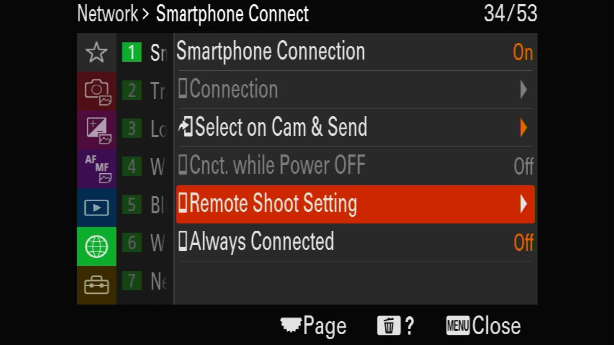

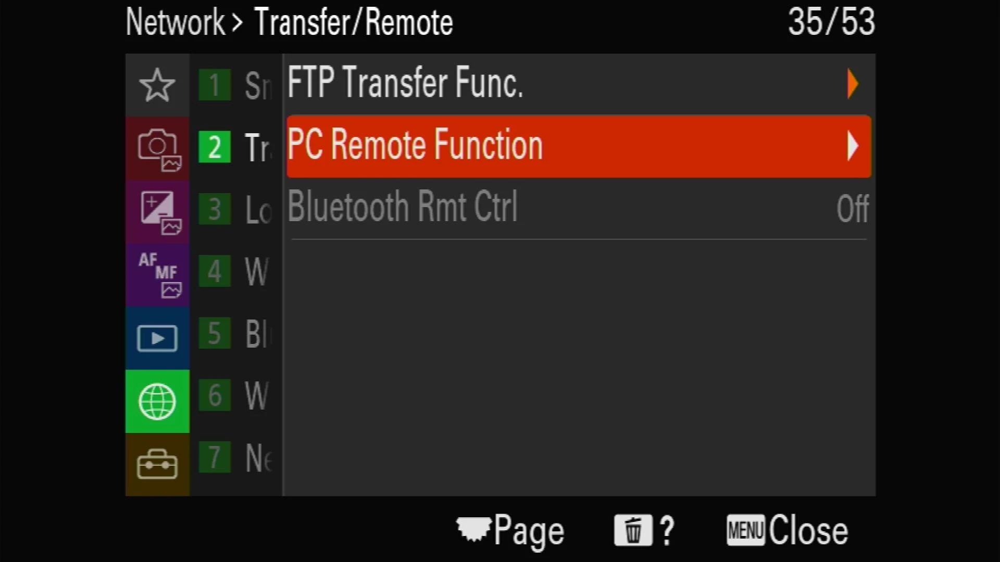

## For PTP capable cameras (newer models) AP mode

When the AlphaFairy code is running on the M5StickC, turn on the camera.

Follow instructions similar to https://support.d-imaging.sony.co.jp/app/imagingedge/en/instruction/4_1_connection.php (note: we are using the Wi-Fi Access Point method, without pairing)

From the camera menu, the option "PC control method" should be "Wi-Fi Access Point".

From the camera menu, airplane mode should be disabled, FTP should be disabled, control-with-smartphone should be disabled.

From the camera menu, the option "connect without pairing" should be enabled. **This is important! Sony cameras don't have an option to un-pair, only through a factory reset, and only one pairing can exist!** If you are having trouble with this step (some cameras do not allow "connect without pairing"), then try the STA connection mode (described below).

From the camera menu, connect to the SSID that the AlphaFairy is broadcasting ("fairywifi" by default), the password should be "1234567890"

On the M5StickC's screen, the "no signal" icon should disappear. On the camera's screen, the `Wi-Fi` symbol should be fully white and the `-PC-` icon should be fully white.

## STA mode, both PTP and HTTP JSON-RPC protocol, all other cameras

Turn on the camera, and activate the "Control from Smartphone" function. This may be implemented differently on different cameras:

 * Newer cameras will present a QR code but also have an option to show the SSID and password as text

 * Older cameras may have a "Smart Remote Embedded" application inside a collection of applications

On the Alpha-Fairy, use the Auto Connect function. A search for the camera will be initiated and when the camera is found, you will be prompted to input the password. Input the password of the camera to complete the connection.

Completing the connection will add the camera to the next available Wi-Fi profile slot. You can chose which profile to boot with by using the Wi-Fi Config menu. Otherwise, using the Auto Connect function again will also work (and the password will be remembered).

## Managing Multiple Cameras

The Alpha-Fairy has 20 available slots for Wi-Fi profiles, each slot can be used for a different camera. Each profile may be used in AP mode (Alpha-Fairy is an access point, camera connects to the Alpha-Fairy) or STA mode (Alpha-Fairy is a station, and connects to the access point presented by the camera).

Slot 0 is always the default slot, AP mode, SSID: "fairywifi", password: "1234567890". This slot cannot be edited. This slot is also used for the web interface.

To select one of the slots/cameras to use, go into the Wi-Fi configuration menu, there is a screen where you can select the slot. To change the slot number, rotate the entire Alpha-Fairy device, a clockwise rotation increments the slot number, counter-clockwise rotation decrements the slot number. Press the big button to save the slot number, and that slot number will be used the next time the Alpha-Fairy boots. (holding the big button will save the slot number and then immediately perform a device reboot)

# General Usage

There are three buttons: "big", "side", and "power"

The side button navigates, chooses the next item.

The big button is used to either enter a menu item, or activate a menu item.

The power button turns the device on, and holding it down for 4 seconds (or more) will shutdown the device. It also acts as an exit button when you press it quickly.

When the battery is low, recharge the remote with an USB-C cable.

## Usage of Features

[Click Here](Full-Features-Guide.md) to view the Full Features Guide

## Motion Controls

When trying to adjust a configurable option, there will be either a plus (+) or minus (-) sign beside the number. Tilting the device to the right will use plus mode, pressing the big button will add to the number. Tilting the device to the left will use minus mode, pressing the big button will subtract from the number.

When in delayed remote shutter mode, completely rotating the device will change the delay.

When in focus pull mode or zoom adjust mode, the tilt of the device determines the speed and direction of the adjustment, press the big button to perform the adjustment.

When prompted to input a password for a Wi-Fi connection, a keyboard is displayed. To select a key on the keyboard, rotate the keyboard around to change the selection. Pressing the big-button will press the highlighted key. Pressing the side-button will toggle between upper-case and lower-case. Pressing the power button will cancel the keyboard. Use the `<xx` key as backspace, and the `>ENT` key is the enter key.

## Status Icons

## Shutter Release Cable Connector

It may be wise to use the intervalometer mode with a shutter release cable, due to the chance of the Wi-Fi connection being unreliable or having too much latency. [See this page for details](doc/Shutter-Release-Cable-Connector.md)

## Focus Knob

A rotary encoder can be purchased (from M5Stack) and connected to the remote to function as a focus pulling knob. It will adjust focus **linearly** with focus-by-wire lenses, one click of the knob equals a fixed number of focus adjustment steps. It is recommended that a larger knob and handle be 3D printed for practical focus pulling, and for attaching to a rig.

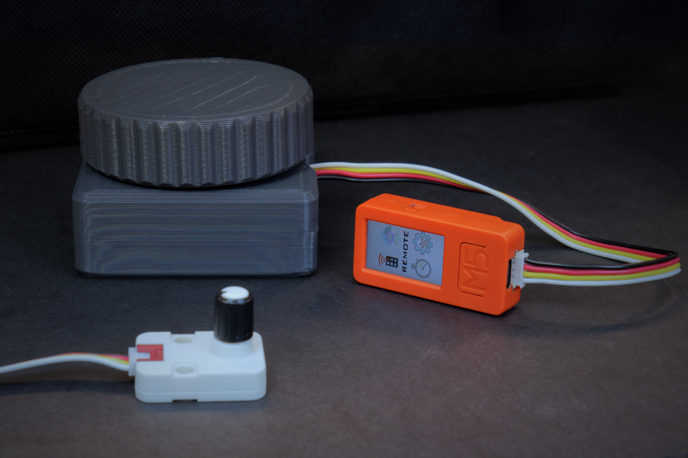
