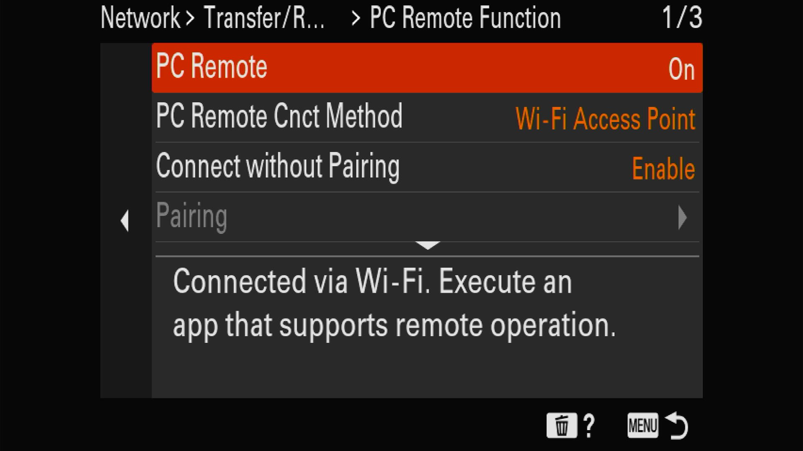
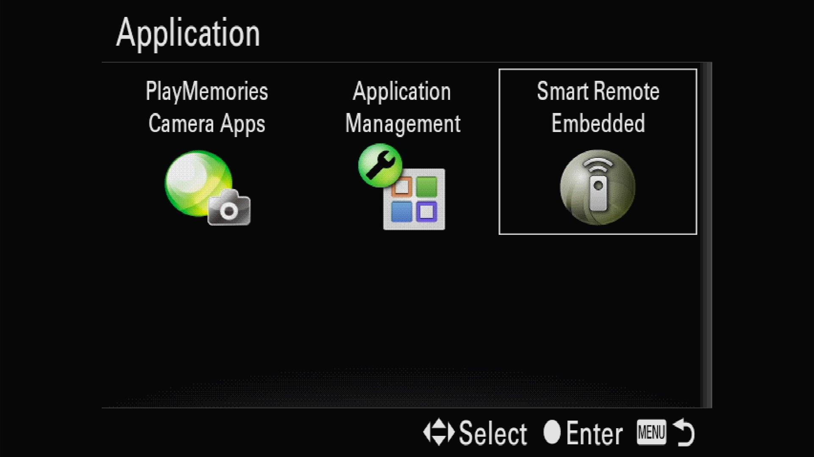
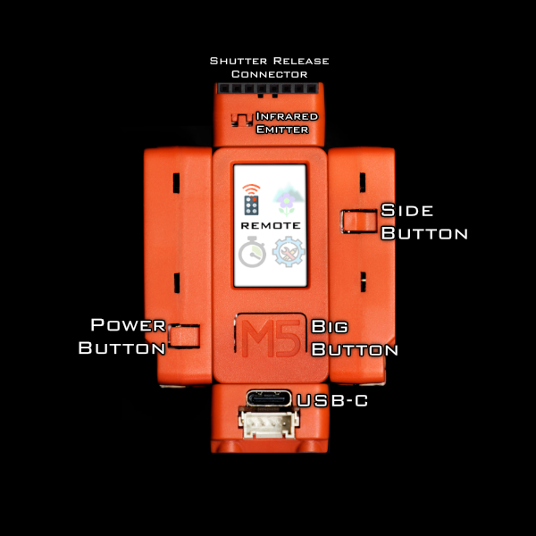
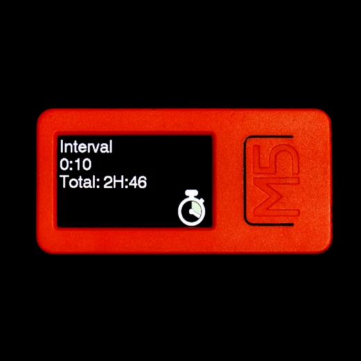
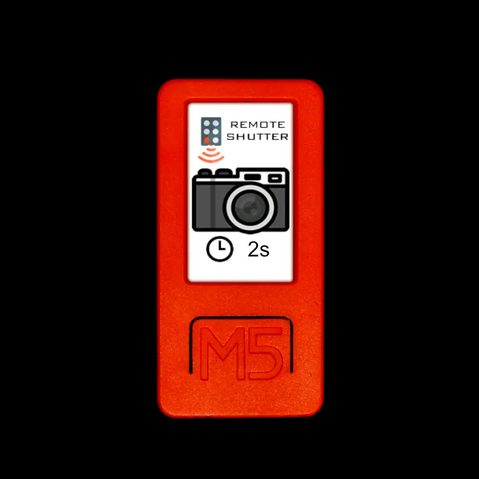
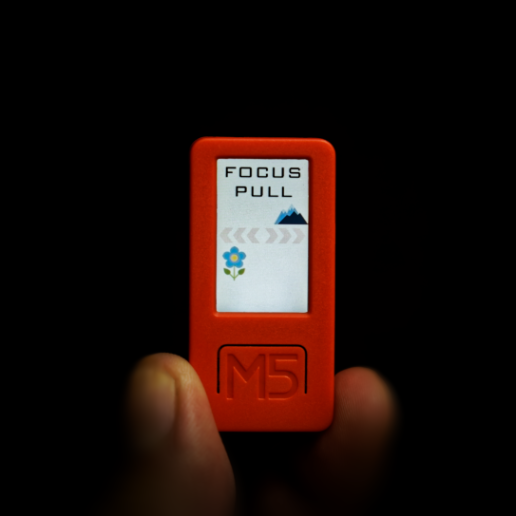
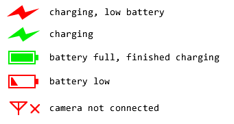
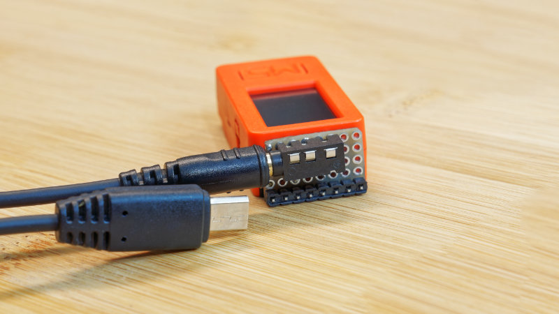

# Installation Setup on PC

This is an open source firmware project, it is free for anybody to download and install onto the M5StickC-Plus. I do not sell any pre-installed units, so for you to build one of these Alpha-Fairy remotes, you must follow these installation instructions.

Install [Arduino IDE](https://www.arduino.cc/en/software), version is 1.8.19 or later

Download a copy of this particular GitHub repo, find the directory called "arduino_workspace". From inside Arduino IDE, use the menu bar, File->Preferences, put the path to "arduino_workspace" into "Sketchbook Location".

Follow instructions to install ESP32 for Arduino IDE
 * official instructions https://docs.espressif.com/projects/arduino-esp32/en/latest/installing.html
 * unofficial instructions https://randomnerdtutorials.com/installing-the-esp32-board-in-arduino-ide-windows-instructions/ , https://microcontrollerslab.com/install-esp32-arduino-ide/

Connect the M5StickC-Plus to the computer, follow instructions to install the FTDI driver (if required): https://docs.m5stack.com/en/quick_start/m5stickc_plus/arduino (this may also contain instructions for steps I've already listed)

Close the Arduino IDE and open it again.

Open Arduino IDE, from the menu bar, select the correct board: Tools->Boards->ESP32 Boards->M5StickC

Select the correct serial port: Tools->Port->(select the option that matches the M5StickC)

Using Arduino IDE, open the file at "arduino_workspace/AlphaFairy/AlphaFairy.ino"

Upload the image files: Tools->"ESP32 Sketch Data Upload"

Click "Upload" on the tool-bar

# Connecting Your Camera

## For PTP capable cameras (newer models)

When the AlphaFairy code is running on the M5StickC, turn on the camera.

Follow instructions similar to https://support.d-imaging.sony.co.jp/app/imagingedge/en/instruction/4_1_connection.php (note: we are using the Wi-Fi Access Point method, without pairing)

From the camera menu, the option "PC control method" should be "Wi-Fi Access Point".

From the camera menu, airplane mode should be disabled, FTP should be disabled, control-with-smartphone should be disabled.

From the camera menu, the option "connect without pairing" should be enabled. (this is important! Sony cameras don't have an option to un-pair, only through a factory reset, and only one pairing can exist!)

From the camera menu, the option "Still Image Save Destination" should be set to "Camera Only".

From the camera menu, connect to the SSID that the AlphaFairy is broadcasting ("fairywifi" by default), the password should be "1234567890"

On the M5StickC's screen, the "no signal" icon should disappear. On the camera's screen, the Wi-Fi symbol should be fully white and the PC icon should be fully white.

## For HTTP JSON-RPC protocol cameras (older models)

Turn on the camera, and activate the "Control from Smartphone" function. This may be implemented differently on different cameras:

 * Newer cameras will present a QR code but also have an option to show the SSID and password as text
 * Older cameras may have a "Smart Remote Embedded" application inside a collection of applications

On the Alpha-Fairy, use the Auto Connect function. A search for the camera will be initiated and when the camera is found, you will be prompted to input the password. Input the password of the camera to complete the connection.

Completing the connection will add the camera to the next available Wi-Fi profile slot.

## Managing Multiple Cameras

The Alpha-Fairy has 99 available slots for Wi-Fi profiles, each slot can be used for a different camera. Each profile may be used in AP mode (Alpha-Fairy is an access point, camera connects to the Alpha-Fairy) or STA mode (Alpha-Fairy is a station, and connects to the access point presented by the camera).

Slot 0 is always the default slot, AP mode, SSID: "fairywifi", password: "1234567890". This slot cannot be edited. This slot is also used for the web interface.

To select one of the slots/cameras to use, go into the Wi-Fi configuration menu, there is a screen where you can select the slot. To change the slot number, rotate the entire Alpha-Fairy device, a clockwise rotation increments the slot number, counter-clockwise rotation decrements the slot number. Press the big button to save the slot number, and that slot number will be used the next time the Alpha-Fairy boots. (holding the big button will save the slot number and then immediately perform a device reboot)

# General Usage

There are three buttons: "big", "side", and "power"

The side button navigates, chooses the next item.

The big button is used to either enter a menu item, or activate a menu item.

The power button turns the device on, and holding it down for 4 seconds (or more) will shutdown the device. It also acts as an exit button when you press it quickly.

When the battery is low, recharge the remote with an USB-C cable.

## Usage of Features

[Click Here](Full-Features-Guide.md) to view the Full Features Guide

## Motion Controls

When trying to adjust a configurable option, there will be either a plus (+) or minus (-) sign beside the number. Tilting the device to the right will use plus mode, pressing the big button will add to the number. Tilting the device to the left will use minus mode, pressing the big button will subtract from the number.

When in delayed remote shutter mode, completely rotating the device will change the delay.

When in focus pull mode or zoom adjust mode, the tilt of the device determines the speed and direction of the adjustment, press the big button to perform the adjustment.

When prompted to input a password for a Wi-Fi connection, a keyboard is displayed. To select a key on the keyboard, rotate the keyboard around to change the selection. Pressing the big-button will press the highlighted key. Pressing the side-button will toggle between upper-case and lower-case. Pressing the power button will cancel the keyboard. Use the `<xx` key as backspace, and the `>ENT` key is the enter key.

## Status Icons

## Shutter Release Cable Connector

It may be wise to use the intervalometer mode with a shutter release cable, due to the chance of the Wi-Fi connection being unreliable or having too much latency. [See this page for details](doc/Shutter-Release-Cable-Connector.md)

