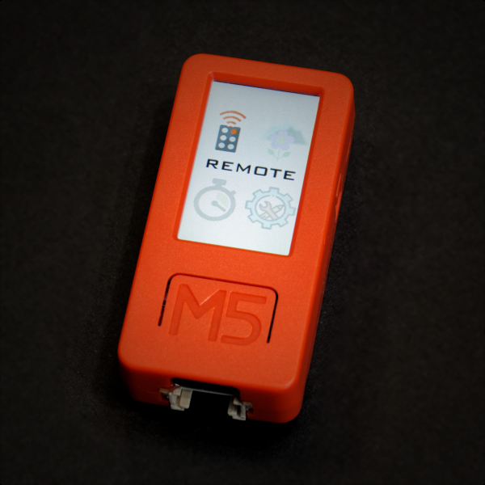
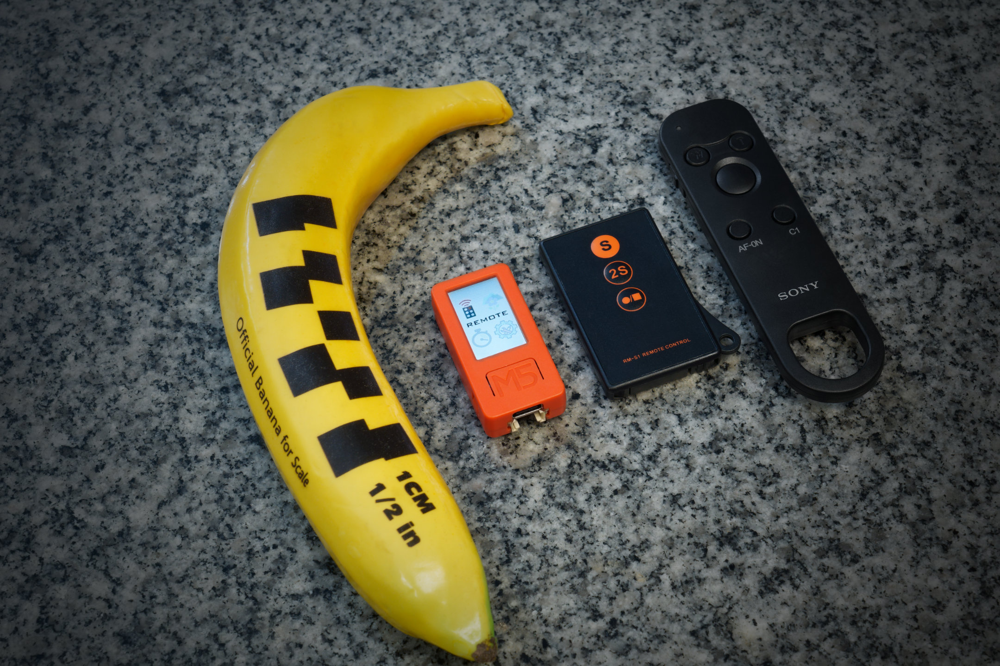

# Alpha-Fairy

This is a tiny remote control for Sony Alpha cameras.

The hardware platform is a [M5StickC-Plus](https://shop.m5stack.com/products/m5stickc-plus-esp32-pico-mini-iot-development-kit), which is a DIY device with a [ESP32-PICO](https://www.espressif.com/en/products/socs/esp32) inside, along with a colour LCD screen, rechargable battery, some buttons, and a few other features.

This remote combines the features of other simple camera remotes, plus many complex functions that automates some tasks that photographers would like to do. It communicates wirelessly with the camera via [Picture Transfer Protocol](https://en.wikipedia.org/wiki/Picture_Transfer_Protocol), mostly reverse engineered by spying on Sony's own [Imaging Edge Remote](https://imagingedge.sony.net/l/ie-desktop.html#remote) application with [Wireshark](https://www.wireshark.org/). A second protocol uses HTTP and supports more cameras but has less features.

This GitHub repo contains the C++ source code (and graphics files) that can be compiled and loaded into the M5StickC-Plus, so anybody can [create this remote](INSTRUCTIONS.md).

Supported camera models: A1, A6600, A6000, RX100M4, RX0M4

Untested but theoretically can support over PTP protocol: A7SM3, A9M2, A7M4A, A7RM4, A7C, A7M4, ZV-E10, listed on https://support.d-imaging.sony.co.jp/app/sdk/en/index.html

Untested but theoretically can support over HTTP protocol: https://developer.sony.com/develop/cameras/api-information/supported-features-and-compatible-cameras

The fun part about this project for me is to create a usable user interface on a device with only two buttons plus an IMU.

## Main Features

 * Remote Shutter (with optional timer), Movie Record, Settings View/Adjust
 * Focus Stack
   * takes consecutive photos as the focus is slowly shifted, this is a technique used in macro photography and some other camera brands offer this in-camera (but not Sony)
 * Focus 9-Point
   * takes consecutive photos as the auto-focus point moves around the scene, to obtain multiple photos focused on multiple objects, convenient for landscape photography
 * Focus Pull
   * with optional focus knob (for **linear** focus pull)
 * Talley Light, Virtual "Top Panel"
 * Sensored Trigger Shutter
   * trigger sources: microphone, voltage input, and/or IMU motion trigger
   * trigger action: take photo, take video (adjustable duration), start intervalometer
   * adjustable delays before arming and after trigger
   * good for security camera applications
 * Dual Shutter
   * takes two consecutive photos, with different shutter speeds, for compositing photos with both sharp subjects and blurred features
 * Intervalometer
   * supports AF-C, different from in-camera intervalometer (which forces AF-S)
 * Astrophotography Intervalometer
   * same as intervalometer but more focused on bulb mode, and uses pause time instead of fixed interval time
 * Focus Frustration
   * is your camera not focusing on the thing you want it to focus on? rapidly tapping the AF button repeatedly will automatically pull the focus back to the nearest possible point

### Minor Features

 * can fall-back to using infrared communication if Wi-Fi is disconnected
 * can use shutter release cable connected to GPIO
 * status bar with battery indicator and connection indicator
 * auto power save
 * configurable options
 * serial port debugging and command line interface
 * smartphone web-browser interface to manage multiple camera logins

## Known Problems

The camera does not re-establish a broken connection. If the remote is turned off (or disconnected for other reasons), you need to turn off the camera and turn it back on (after the remote is turned back on).

The features that can change shutter speed are not reliable. The camera takes a long (and variable) time to register a remote command to change the shutter speed. By long, I mean sometimes up to several seconds, or never.

Battery life is a bit short. Do not use it for intervalometer purposes without an external power source. Also, using Wi-Fi for intervalometer is ill-advised (reliability and latency issues), use a real shutter release cable if possible.

## More

 * [Instructions for Setup and Usage](INSTRUCTIONS.md)
 * [Full Features Guide](Full-Features-Guide.md)
 * [Firmware Engineering](doc/Firmware-Engineering.md)
 * [Camera Reverse Engineering](doc/Camera-Reverse-Engineering.md)
 * [My personal website blog post](https://eleccelerator.com/alpha-fairy-wireless-camera-remote/)

## Demo Videos

https://user-images.githubusercontent.com/1427911/187117478-654adc80-a0a3-48cf-8b0b-643bfd7b2884.mp4

https://user-images.githubusercontent.com/1427911/187117818-dda28b7c-d5e2-45bd-96e9-6ff3c6a178e0.mp4
