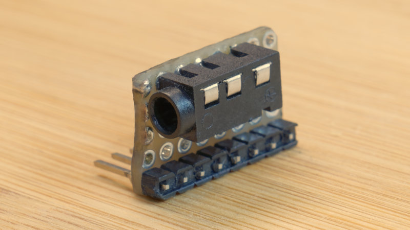
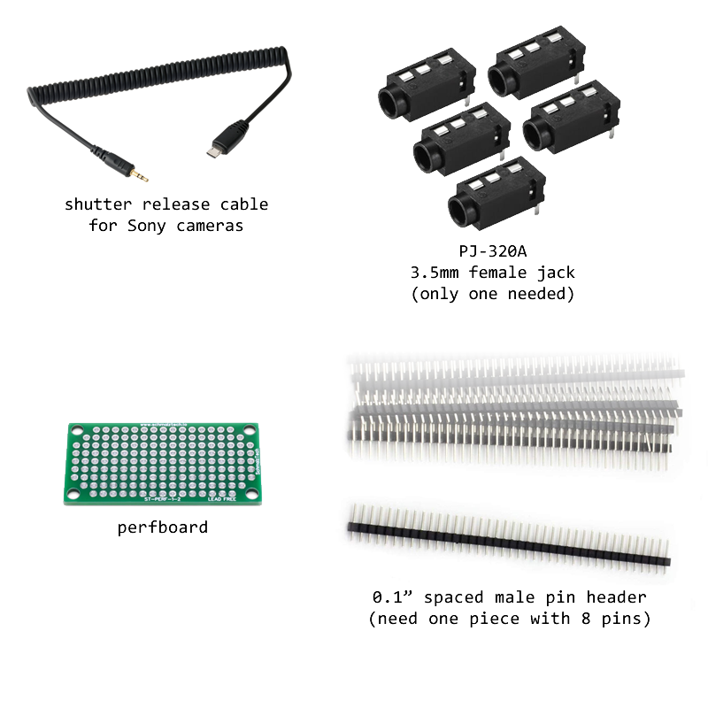

# Shutter Release Cable Attachment

It may be wise to use the intervalometer mode with a shutter release cable, due to the chance of the Wi-Fi connection being unreliable or having too much latency.

The M5StickC-Plus that the Alpha-Fairy is built upon has a pin connector at the end. You can construct something that connects a shutter release cable to this connector.

You need:

 * a shutter release cable for Sony cameras, it should be USB-micro-B on one end and 3.5mm TRS male plug on the other
 * a chunk of perfboard, a kind of circuit board that has holes arranged in a grid. you only need 5 holes by 8 holes so you will probably buy a big one and cut it down
 * a PJ-320A jack, which is a 3.5mm TRS female jack, commonly found on Amazon/Ebay/(some other cheap online store) sold in large packs
 * some wire, soldering equipment, something that can cut perfboard, a small file, etc

This diagram below shows how it should be put together, make it look like the photo above

